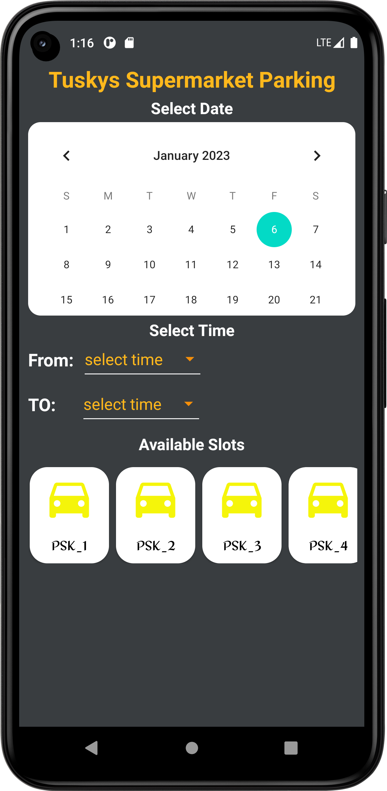

# MParking
Mparking is an android application that enables users to locate parking spaces, reserve and pay for parking
# Still Under Development
# Sreenshots
    

## Tech Stack.
- [Java](https://developer.android.com/studio/write/java8-support?gclid=CjwKCAiA68ebBhB-EiwALVC-NrHBWyF1NkQ3cE87Mr94ZDB2BsAxAsRpCmDJqi6vEKDlOeLfjhr_aRoCTwgQAvD_BwE&gclsrc=aw.ds) - Java is a programming language that can run on JVM. Google announced Java as one of its officially supported programming languages in Android Studio;
- [LiveData](https://developer.android.com/topic/libraries/architecture/livedata) -  A lifecycle-aware data holder with the observer pattern
- [View Binding](https://developer.android.com/topic/libraries/data-binding/) - Allows you to bind UI components in your layouts to data sources in your app using a declarative format rather than programmatically.
- [GitHub Actions](https://github.com/features/actions) - GitHub Actions makes it easy to automate all your software workflows, now with world-class CI/CD. Build, test, and deploy your code right from GitHub. Make code reviews, branch management, and issue triaging work the way you want.
- [Glide](https://github.com/bumptech/glide)- An image loading and caching library for Android focused on smooth scrolling.
- [SavedStateHandle](https://developer.android.com/guide/navigation/navigation-programmatic) - Getting results from a destination when navigating from one fragment to another
- [SafeApiCall](https://github.com/JoelKanyi/Savings-Zetu-App/blob/main/app/src/main/java/com/kanyideveloper/savingszetu/utils/ExtensionFunctions.kt) Making safe Firebase network calls
- [Firebase Functions](https://firebase.google.com/docs/functions) - Cloud Functions for Firebase is a serverless framework that lets you automatically run backend code in response to events triggered by Firebase features and HTTPS requests.
- [Firebase Database](https://firebase.google.com/docs/database) - Store and sync data with our NoSQL cloud database. Data is synced across all clients in realtime, and remains available when your app goes offline.
- [Firebase Authentication](https://firebase.google.com/docs/auth) - Firebase Authentication provides backend services, easy-to-use SDKs, and ready-made UI libraries to authenticate users to your app.
- [Firebase Messaging](https://firebase.google.com/docs/cloud-messaging) - Firebase Cloud Messaging (FCM) is a cross-platform messaging solution that lets you reliably send messages at no cost.
- [Firebase Storage](https://firebase.google.com/docs/storage) - Cloud Storage for Firebase is a powerful, simple, and cost-effective object storage service built for Google scale.
- [Gooogle Maps](https://mapsplatform.google.com/) - The Google Maps API is one of those clever bits of Google technology thathelps you take the power of Google Maps and put it directly on your own site. lets you add relevant content that is useful to your visitors and customisethe look and feel of the map to fit with the style of your site.

## Setup Requirements
- Android device or emulator
- Android Studio
- Create your own Firebase project and replace the `google-services.json` with yours.
- Create your own Maps project and replace the `API_KEY` with yours.

### Getting Safaricom Daraja-Api Credentials
1. Create an account on the [Safaricom Developer Portal] (https://developer.safaricom.co.ke/)
2. Create a Lipa na MPESA Online App
3. Copy and use the provided 'Secret_Key' and 'Consumer_key' in your code at the gradle properties

### Getting Googls Mapas API Credentials
1. Create an account on the [Google Cloud Console] (https://mapsplatform.google.com/)
2. Create a new project and navigate to the API and Credentials
3. Click the API or SDK you want to enable
4. On the Credentials page, click Create credentials > API key.The API key created dialog displays your newly created API key.
5. Copy and use the provided 'API_Key' and use it in your code in the string folder.

### Getting Firebase 
1. Create an account on the [Google Firebase Console] (https://console.firebase.google.com/)
2. Create a new project and navigate through
3. Go back to android studeio in the tools at the menu select firbase. a pop up window displays from the right of the screen connect your android project to firebase
4. Enable firbase authenticatios

## Getting Started
In order to get the app running yourself, you need to:
1.  Clone this project
2.  Import the project into Android Studio
3.  Connect your android device with USB or use your emulator
4.  After the project has finished resolving dependencies and building you run

## Development
For contributions.!
To fix a bug or enhance an existing module, follow these steps:

- Fork the repo
- Create a new branch (`git checkout -b improve-feature`)
- Make the appropriate changes in the files
- Add changes to reflect the changes made
- Commit your changes (`git commit -am 'Improve feature'`)
- Push to the branch (`git push origin improve-feature`)
- Create a Pull Request

## Support
- Found this project useful ❤️? Support by clicking the ⭐️ button on the upper right of this page. ✌️
- Notice anything else missing? File an issue 
- Feel free to contribute in any way to the project from typos in docs to code review are all welcome.
